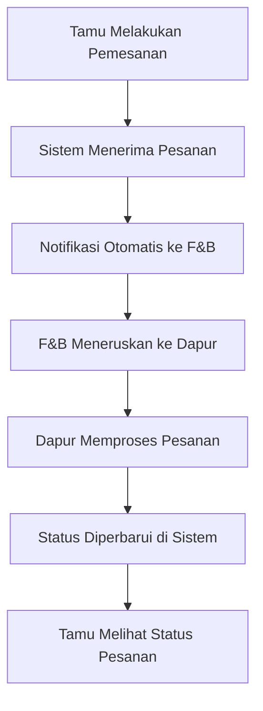

# 🍽️ Horison Room Service – Hotel Food Ordering System

**Horison Room Service** adalah platform berbasis web yang dirancang untuk memudahkan tamu hotel dalam memesan makanan dan minuman langsung dari kamar, tanpa harus menelepon resepsionis atau restoran.  
Sistem ini terintegrasi langsung dengan bagian **Food & Beverage (F&B)** dan dapur, memastikan setiap pesanan diterima dan diproses dengan cepat serta efisien.

---

## 📋 Daftar Isi
- [Fitur Utama](#-fitur-utama)
- [Role Pengguna](#-role-pengguna)
- [Teknologi yang Digunakan](#-teknologi-yang-digunakan)
- [Instalasi](#-instalasi)
- [Konfigurasi](#-konfigurasi)
- [Cara Kerja Aplikasi](#-cara-kerja-aplikasi)
- [Tujuan dan Manfaat](#-tujuan-dan-manfaat)
- [Preview Tampilan](#-preview-tampilan)
- [Flow Sistem](#-flow-sistem)

---

## ✨ Fitur Utama

- 🛎️ **Pemesanan Langsung dari Kamar**  
  Tamu dapat melakukan pemesanan makanan dan minuman langsung dari kamar tanpa perlu menelepon.

- 🍴 **Integrasi dengan Bagian F&B dan Dapur**  
  Setiap pesanan dikirim otomatis ke bagian F&B untuk diteruskan ke dapur agar segera diproses.

- 📋 **Manajemen Menu dan Promo**  
  Admin dapat menambah, menghapus, dan memperbarui menu makanan, minuman, menu baru, promo, serta data pengguna.

- 🔔 **Notifikasi Pesanan Real-Time**  
  Sistem memberikan notifikasi otomatis kepada F&B setiap kali ada pesanan baru.

- 📱 **Responsive Design**  
  Tampilan web dirancang agar nyaman digunakan di berbagai perangkat, baik smartphone, tablet, maupun komputer.

- 💬 **Status Pemesanan**  
  Tamu dapat memantau status pesanan — mulai dari *Received*, *On Process*, hingga *Delivered*.

---

## 👥 Role Pengguna

| Role | Deskripsi |
|------|------------|
| **User (Tamu Hotel)** | Melihat menu, memilih makanan/minuman, dan melakukan pemesanan langsung dari kamar. |
| **Admin** | Mengelola data makanan, minuman, menu baru, promo, dan pengguna. |
| **F&B (Food & Beverage)** | Menerima notifikasi pesanan dari tamu dan menyampaikan pesanan ke dapur. |

---

## 🛠️ Teknologi yang Digunakan

### Backend
- **Laravel 10.x** – Framework utama untuk pengelolaan data dan logic aplikasi.  
- **MySQL** – Database penyimpanan seluruh data makanan, pesanan, dan pengguna.  
- **PHP 8.1+** – Bahasa pemrograman utama.

### Frontend
- **Blade Templates** – Template engine bawaan Laravel.  
- **Tailwind CSS** – Framework CSS untuk tampilan yang modern dan responsif.

---

## 🚀 Instalasi

### 1. Clone Repository
```bash
git clone https://github.com/username/horison-room-service.git
cd horison-room-service
```

### 2. Install Dependencies PHP
```bash
composer install
```

### 3. Install Dependencies Node.js
```bash
npm install
# atau
yarn install
```

### 4. Copy Environment File
```bash
cp .env.example .env
```

### 5. Generate Application Key
```bash
php artisan key:generate
```

### 6. Buat Database
Buat database MySQL baru dengan nama `horison_room_service` atau sesuai keinginan Anda.

### 7. Konfigurasi Database
Edit file `.env` dan sesuaikan konfigurasi berikut:
```env
DB_CONNECTION=mysql
DB_HOST=127.0.0.1
DB_PORT=3306
DB_DATABASE=horison_room_service
DB_USERNAME=your_username
DB_PASSWORD=your_password
```

### 8. Jalankan Migration dan Seeder
```bash
php artisan migrate --seed
```

### 9. Build Assets
```bash
npm run build
# untuk development
npm run dev
```

---

## ⚙️ Konfigurasi

Sesuaikan konfigurasi aplikasi di file `.env`:
```env
APP_NAME="Horison Room Service"
APP_ENV=local
APP_DEBUG=true
APP_URL=http://localhost:8000
```

---

## 🍳 Cara Kerja Aplikasi

1. **Tamu melakukan pemesanan** melalui web dari kamar.  
2. **Sistem mengirimkan notifikasi otomatis** ke bagian F&B.  
3. **F&B menyampaikan pesanan ke dapur** untuk diproses.  
4. **Status pesanan diperbarui secara otomatis**, sehingga tamu dapat memantau progresnya secara real-time.

---

## 🎯 Tujuan dan Manfaat

- Meningkatkan efisiensi pelayanan hotel tanpa perlu panggilan telepon.  
- Mengurangi potensi miskomunikasi antara tamu dan staf.  
- Mempercepat proses pemesanan dan pengantaran makanan.  
- Memberikan pengalaman modern dan nyaman bagi tamu hotel.

---

## 🖼️ Preview Tampilan

> *(Tambahkan screenshot di sini setelah aplikasi berjalan)*

Contoh:
```md


```

---

## 🔄 Flow Sistem



---

**Horison Room Service** – *“Ordering made simple, comfort made personal.”* 🌙

Dibuat oleh **Christabel Aurelia**
